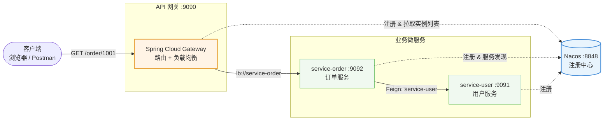

# cloud-demo-nacos

> 基于 **Spring Cloud Alibaba + Nacos** 的微服务实战项目：API 网关统一入口、服务注册与发现、Feign 声明式服务间调用。
> 本地已完成**全链路实跑验证**（Nacos → user → order → gateway 四进程联调通过）。


---

## 项目简介

这是一个「去中心化地址」的微服务示例。传统写法里，服务 A 要调服务 B，必须在代码或配置里**写死** B 的 `IP:端口`——一旦 B 换机器、改端口、扩容成多台，A 就得改代码重新发布。

本项目用 **Nacos 注册中心**解决这个问题：

- 每个服务启动时把「我叫什么名字、我在哪」**主动上报**给 Nacos；
- 调用方只需要说「我要找 `service-user`」，具体地址由 Nacos 实时给出；
- 网关路由写成 `lb://service-user`，`lb` 前缀表示「交给负载均衡器去 Nacos 查地址」。

## 架构设计



**请求链路（三级调用）**：客户端只认网关的 `9090` 端口 → 网关查 Nacos 找到订单服务 → 订单服务再查 Nacos 找到用户服务 → 逐层返回聚合结果。全程没有任何一处写死 IP。

## 技术栈

| 组件 | 版本 | 作用 |
|---|---|---|
| Java | 17 | 运行环境 |
| Spring Boot | 3.3.4 | 基础框架 |
| Spring Cloud | 2023.0.3 | 微服务体系 |
| Spring Cloud Alibaba | 2023.0.3.2 | Nacos 集成 |
| Nacos | 2.4.3 | 服务注册与发现 |
| Spring Cloud Gateway | — | API 网关、路由转发 |
| OpenFeign | — | 声明式 HTTP 客户端 |
| Spring Cloud LoadBalancer | — | 客户端负载均衡（`lb://` 依赖它） |

> 版本组合经官方兼容性矩阵校验：Spring Boot 3.3.x ↔ Spring Cloud 2023.0.x ↔ Alibaba 2023.0.3.2。三者版本必须配套，随意升级任一项都会启动失败。

## 项目结构

```
cloud-demo-nacos/
├── pom.xml                     # 父工程：统一管理依赖版本
├── gateway/                    # API 网关（唯一对外暴露的端口 9090）
│   ├── pom.xml                 # 关键：gateway + nacos-discovery + loadbalancer
│   └── src/main/
│       ├── java/.../GatewayApplication.java
│       └── resources/application.yml   # 路由规则 lb://service-xxx
├── service-order/              # 订单服务 :9092
│   ├── src/main/java/.../
│   │   ├── OrderApplication.java
│   │   ├── OrderController.java        # 对外接口
│   │   └── UserClient.java             # Feign 接口，只写服务名不写地址
│   └── resources/application.yml
└── service-user/               # 用户服务 :9091
    └── src/main/java/.../UserController.java
```

## 快速开始

### 前置条件

- JDK 17 及以上（**必须 64 位**，Nacos 内嵌的 RocksDB 不支持 32 位 JVM）
- Maven 3.8+
- Nacos Server 2.4.3（独立程序，约 150MB，不包含在本仓库中）

### 1. 启动 Nacos

从 [Nacos Releases](https://github.com/alibaba/nacos/releases) 下载 `nacos-server-2.4.3.zip` 并解压，以单机模式启动：

```bash
# Windows
cd nacos/bin
startup.cmd -m standalone

# Linux / macOS
sh startup.sh -m standalone
```

启动成功后访问控制台 <http://localhost:8848/nacos> 确认（默认账号密码均为 `nacos`）。

### 2. 编译打包

```bash
git clone https://github.com/xiongsifu/cloud-demo-nacos.git
cd cloud-demo-nacos
mvn clean package -DskipTests
```

> 编译产物 `target/` 目录已按规范加入 `.gitignore`，不纳入版本控制——这是 Java 项目的标准做法（源码 12 KB，编译产物却有 117 MB）。所以 clone 之后**必须先执行上面的打包命令**才会生成 jar。

### 3. 依次启动三个服务

开三个终端窗口，**注意顺序**：先起被调用方，最后起网关。

```bash
# 终端 1 —— 用户服务
java -jar service-user/target/service-user-1.0.0.jar

# 终端 2 —— 订单服务（依赖 user）
java -jar service-order/target/service-order-1.0.0.jar

# 终端 3 —— 网关（依赖上面两个都已注册到 Nacos）
java -jar gateway/target/gateway-1.0.0.jar
```

### 4. 验证

打开 Nacos 控制台 → 服务管理 → 服务列表，应能看到 `gateway`、`service-order`、`service-user` 三个服务均已注册。

然后调用接口：

```bash
curl http://localhost:9090/order/1001
```

实际返回：

```json
{
  "orderNo": "1001",
  "amount": 199.0,
  "status": "已支付",
  "userName": "张三",
  "callUserService": "成功（经 Nacos 服务发现）"
}
```

返回里出现 `userName` 就说明**三级链路全部打通**：网关经 Nacos 找到了订单服务，订单服务又经 Nacos 找到了用户服务。

同样可以直接经网关访问用户服务：

```bash
curl http://localhost:9090/user/1
# => {"id":1,"name":"张三","email":"zhangsan@example.com"}
```

## 实现要点

### 服务间调用：只声明服务名

```java
// service-order/src/main/java/com/example/order/UserClient.java
@FeignClient(name = "service-user")   // 只写服务名，地址由 Nacos 解析
public interface UserClient {
    @GetMapping("/user/{id}")
    Map<String, Object> getById(@PathVariable("id") Long id);
}
```

对比写死地址的做法 `@FeignClient(name = "service-user", url = "http://localhost:9091")`——后者一旦对方换端口就得改代码重新部署。

### 网关路由：`lb://` 动态解析

```yaml
spring:
  cloud:
    gateway:
      routes:
        - id: order-route
          uri: lb://service-order      # lb = LoadBalancer，从 Nacos 拿实例列表
          predicates:
            - Path=/order/**
```

## 踩坑记录

### 网关返回 503 Service Unavailable

**现象**：Nacos 正常、三个服务都注册成功、直连 `http://localhost:9092/order/1001` 也能通，但只要经过网关 `http://localhost:9090/order/1001` 就固定返回 **503**。

**排查过程**：

1. 先确认服务名对得上——`service-order` 的 `spring.application.name` 与网关的 `lb://service-order` 完全一致，排除拼写问题；
2. 确认 Nacos 里实例真实存在——控制台服务列表里三个服务都在，排除注册失败；
3. 对比 `service-order/pom.xml` 与 `gateway/pom.xml` 的依赖差异，发现**网关缺了一个依赖**。

**根因**：Spring Cloud 2022.0 之后，`spring-cloud-starter-gateway` **不再自动传递** LoadBalancer 依赖。而 `lb://` 协议的解析完全依赖它——缺失时网关无法把服务名转换成真实地址，于是所有路由一律返回 503。

**解决**：在 `gateway/pom.xml` 中显式引入：

```xml
<dependency>
    <groupId>org.springframework.cloud</groupId>
    <artifactId>spring-cloud-starter-loadbalancer</artifactId>
</dependency>
```

> 这个坑的隐蔽之处在于：**启动完全不报错**，日志一切正常，只有真正发起请求时才暴露。而且 503 属于「服务不可用」的通用错误码，很容易被误判成下游服务挂了，从而把排查方向带偏。

### Nacos 启动报 `ARCH='x86'`

**现象**：启动 Nacos 时报 `Cannot determine JNI library name for ARCH='x86'`，与 RocksDB 相关。

**根因**：Nacos 的 Raft 一致性协议底层用 RocksDB 存储，而 RocksDB **只提供 64 位原生库**。如果系统里默认的 `java` 指向的是 32 位 JVM（例如老版本 JDK 8 的 Client VM），就会因为找不到匹配的本地库而启动失败。

**解决**：确认使用 64 位 JDK 启动。可通过以下命令检查：

```bash
java -XshowSettings:properties -version 2>&1 | grep os.arch
# 期望输出 os.arch = amd64（若显示 x86 则为 32 位）
```

## 与基础版的区别

本项目是 `cloud-demo`（服务地址写死版）的进阶版本：

| 对比项 | cloud-demo（基础版） | cloud-demo-nacos（本项目） |
|---|---|---|
| 服务发现 | 无，配置里写死 `IP:端口` | Nacos 自动注册与发现 |
| Feign 调用 | `@FeignClient(url="http://localhost:9091")` | `@FeignClient(name="service-user")` |
| 网关路由 | `uri: http://localhost:9091` | `uri: lb://service-user` |
| 扩容支持 | 不支持，加机器要改配置 | 支持，新实例自动加入负载均衡 |
| 外部依赖 | 无 | 需先启动 Nacos |
| 适用场景 | 理解微服务基本原理 | 贴近生产的真实做法 |

## License

MIT
